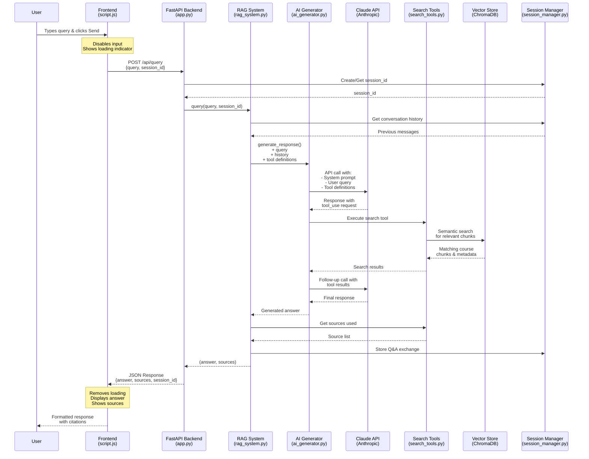

# RAG Chatbot Query Flow Diagram

## Key Components

### 1. **Frontend Layer**
- **script.js**: Handles UI interactions, sends AJAX requests, displays responses

### 2. **API Layer**
- **FastAPI (app.py)**: REST API endpoints, request/response models, CORS handling

### 3. **RAG Orchestration**
- **RAGSystem**: Coordinates between all components
- **SessionManager**: Maintains conversation context
- **ToolManager**: Manages available search tools

### 4. **AI Processing**
- **AIGenerator**: Interfaces with Claude API
- **Claude API**: Generates responses, decides when to use tools

### 5. **Knowledge Base**
- **SearchTools**: Executes semantic searches
- **VectorStore (ChromaDB)**: Stores embeddings of course content
- **DocumentProcessor**: Chunks and processes course documents

## Data Flow

1. **Request Flow** (↓)
   - User input → Frontend → Backend → RAG System → AI Generator → Claude API

2. **Tool Execution** (↔)
   - Claude requests tool use → Search Tools → Vector Database → Return results

3. **Response Flow** (↑)
   - Claude response → AI Generator → RAG System → Backend → Frontend → User

## Session Management
- Session IDs maintain conversation continuity
- History is passed to Claude for context-aware responses
- Each Q&A exchange is stored for future reference

## Search Process
1. Claude analyzes query and decides if search is needed
2. Executes CourseSearchTool with semantic search
3. ChromaDB returns relevant chunks based on embeddings
4. Claude synthesizes search results into coherent answer